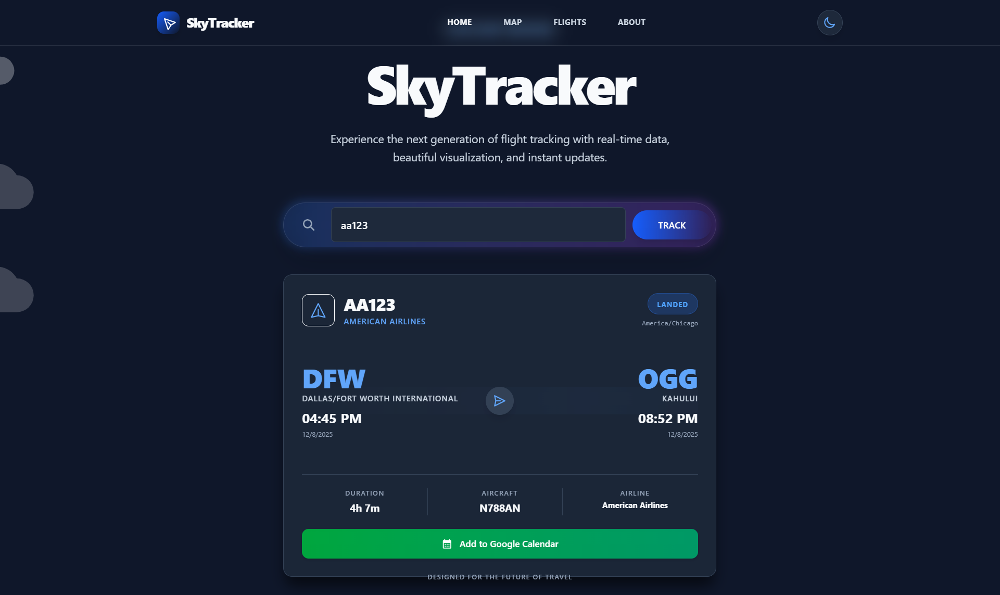
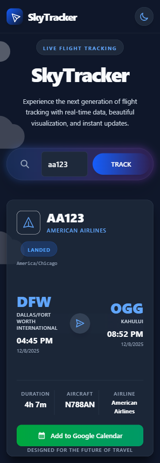

# ✈️ SkyTracker

[SkyTracker Vercel Demo](https://sky-scanner-pi.vercel.app/)

> **Experience the next generation of flight tracking with real-time data, beautiful visualization, and instant updates.**

SkyTracker is a modern, high-performance flight tracking application built with the latest web technologies. It features a stunning UI with glassmorphism effects, smooth animations, and a responsive design that looks great on any device.

## ✨ Features

- **🔍 Real-time Flight Tracking**: Instant search and status updates for flights worldwide.
- **🎨 Modern UI/UX**: Sleek interface with glassmorphism, blur effects, and smooth transitions.
- **🌓 Dark & Light Mode**: Fully themed experience with seamless toggle switching.
- **📱 Fully Responsive**: Optimized for mobile, tablet, and desktop devices.
- **⚡ High Performance**: Built on Next.js 15 for lightning-fast page loads and SEO.

## 🛠️ Tech Stack

- **Framework**: [Next.js 16](https://nextjs.org/) (App Router)
- **Language**: [TypeScript](https://www.typescriptlang.org/)
- **Styling**: [Tailwind CSS v4](https://tailwindcss.com/)
- **UI Library**: [React 19](https://react.dev/)
- **Icons**: Heroicons / Lucide React

## 🚀 Getting Started

Follow these steps to run the project locally:

1.  **Clone the repository**
    ```bash
    git clone https://github.com/yourusername/flght-tracker.git
    cd flght-tracker
    ```

2.  **Install dependencies**
    ```bash
    npm install
    ```

3.  **Run the development server**
    ```bash
    npm run dev
    ```

4.  **Open your browser**
    Navigate to [http://localhost:3000](http://localhost:3000) to see the app in action.

## 📦 Deployment

This project is optimized for deployment on **Vercel**.

[](https://vercel.com/new/clone?repository-url=https%3A%2F%2Fgithub.com%2Fyourusername%2Fflght-tracker)

> **Note**: You can easily deploy this by connecting your GitHub repository to Vercel.

## 📸 Screenshots

### Desktop View

  

### Mobile View

 

*(Add your screenshots to the `public` folder and update the filenames above)*

## 📄 License

This project is licensed under the MIT License - see the [LICENSE](LICENSE) file for details.
